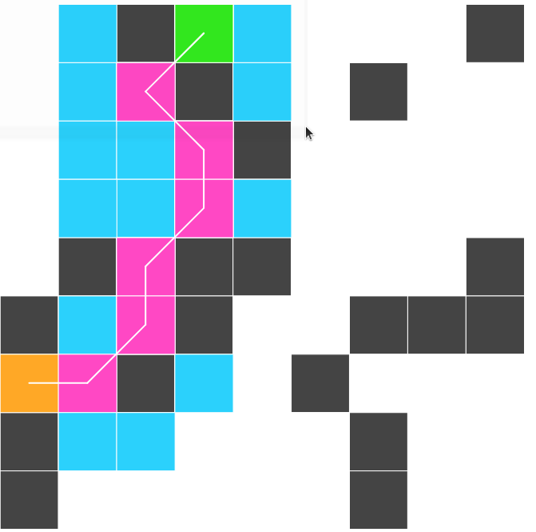

# A* Searching for Mazes

https://adamjc.github.io/a-star

There is an error in my algorithm somewhere, as you can see below, the path that is chosen doesn't appear to be consistent, assuming h(n) = euclidean distance between n and e

## There's side effects all over the place dude, wth

Yeah, well, that's game development for you... I mean, you *could* use something like [elm](https://elm-lang.org/)... but it's quicker, and more importantly *easier to understand* to be imperative. Well, simpler except for the side effects. Just keep your state minimal.