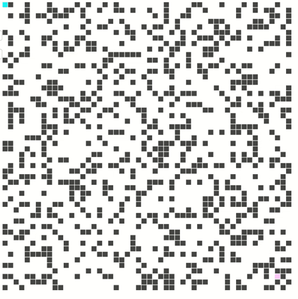

# A* Searching for Mazes

https://adamjc.github.io/a-star

It's not completely perfect, but I think the algorithm is correct. I've made a minor optimization so that unless `f(h)` is *much* better than current `f(h)`, we will still continue on our path.

## There's side effects all over the place dude, wth

Yeah, well, that's game development for you... I mean, you *could* use something like [elm](https://elm-lang.org/)... but it's quicker, and more importantly *easier to understand* to be imperative. Well, simpler except for the side effects. Just keep your state minimal.